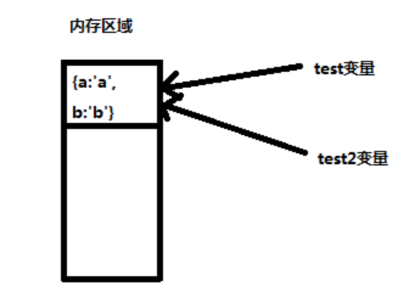
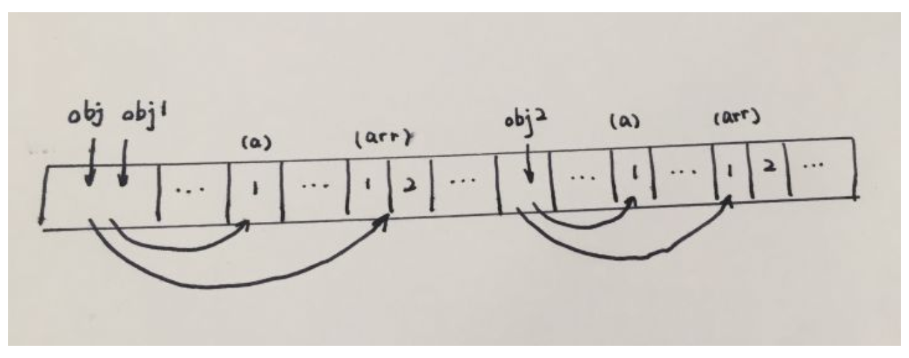

# Js 深拷贝 浅拷贝

平常我们把字符串，数字的值赋值给新变量，相当于把值完全复制过去，新变量的值改变不会影响旧变量

```js
let num = 123
let num2 = num
num2 = 321
console.log(num) //123
console.log(num2) //321	
```

但是对象就不同

> 对象通过引用来传递 它们永远不会被复制

## 浅拷贝

> 在很多情况下，我们都需要给变量赋值，给内存地址赋予一个值，但是在赋值引用值类型的时候，只是共享一个内存区域，导致赋值的时候，还跟之前的值保持一直性。

比如: 

```js
let test1 = {
  a: 'a',
  b: 'b'
}

let test2 = test1

test2.a = 2
test.a === 2	// true
```




这下就很好理解为什么引用值类型数据相互影响问题。


## 深度拷贝



> 将原对象的各个属性逐个复制出去，而且将原对象各个属性所包含的对象也依次采用深复制的方法**递归复制**到新对象上


实现一个深拷贝函数，就不得不说javascript的数值类型。

**判断javascript类型**

javascript中有以下基本类型

| 类型        | 描述                                    |
| --------- | ------------------------------------- |
| undefined | undefined类型只有一个值undefined，它是变量未被赋值时的值 |
| null      | null类型也只有一个值null, 它是一个空的对象引用          |
| Boolean   | Boolean有两种取值true和false                |
| String    | 它表示文本信息                               |
| Number    | 它表示数字信息                               |
| Object    | 它是一系列属性的无序集合， 包括函数Function和数组Array    |

- 先判断类型 在传值调用复制方法（递归调用，枚举其属性值复制添加到新的对象上）

```js
function cloneDeep(obj){
            if( Object.keys(obj).length === 0 || !(obj instanceof Arrary) ){
                return obj
            }
            let resultData = {}
            return recursion(obj, resultData)
        }

function (obj, data={}){
            for(key in obj){
                if( typeof obj[key] == 'object' && Object.keys(obj[key].length>0 )){
                    data[key] = recursion(obj[key])
                }else{
                    data[key] = obj[key]
                }
            }
            return data
        }
let obj = {name:'程序猿',age:{child:20}}
let obj2 = cloneDeep(obj)
obj.name = '大佬'
obj2.age.child = 24
console.log(obj) // {name:'程序猿',age:{child:20}}
```


### 深拷贝方法


####Object.assgin

[参考](https://developer.mozilla.org/zh-CN/docs/Web/JavaScript/Reference/Global_Objects/Object/assign)

`Object.assign()` 方法用于将所有可枚举属性的值从一个或多个源对象复制到目标对象。它将返回目标对象。

```js
Object.assign(target, ...sources)
```

复制一个对象: 

```js
var obj = { a: 1 };
var copy = Object.assign({}, obj);
console.log(copy); // { a: 1 }
```

省略很多...

####JSON

或者使用 ->` JSON.stringify` 和 `JSON.parse` 可实现将js对象实现深度拷贝

```js
let h = JSON.parse(JSON.stringify(a))
```

